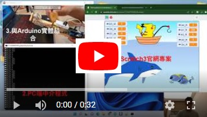
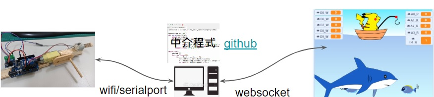

# ScratchHttpMiddleWare
a simple scratchclient project communicate with nodemcu

### 在python中 使用 scratchclient 和 scratch3官網做各種互動
本專案利用PC端 「讀寫雲端變數」 之功能，將 序列埠/WIFI 接收到的訊號傳遞給 scratch3之專案,  
藉此可和 Arduino、nodeMCU 等開發板做互動。   
- nodemcu：  
  - 輸出：  
    - PWM 輸出埠 D6 (0-255)
  - 輸入：  
    - 類比埠 A0
- PC 端：  
  中介程式參數說明如下：
  - ScratchHttpMiddleWare.exe <使用者名稱> <密碼> <scratch專案編號> 
  ex:  
  ScratchHttpMiddleWare.exe ccsh_ky 123456987 724014896 
  
- Scratch3 端雲端變數：  
  - 讀取 Arduino port 內容：
    - A0_R:讀取 A0 類比埠之電壓對應值 0-255
  - 寫入 Arduino port :
    - D6_W:寫入 D6 PWM 電壓對應值 0~255
   
  Scratch3 範本：https://scratch.mit.edu/projects/725470383/ 
